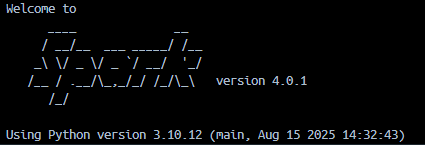

# Выполнил: Кусков Арсений

# Из демо PostgreSQL базы данных загрузите таблицы в PySpark DataFrames.

## Используя эти данные (без SQL) напишите PySpark код для того, чтобы:

- Вывести количество фильмов в каждой категории, отсортировать по убыванию.

- Вывести 10 актеров, чьи фильмы большего всего арендовали, отсортировать по убыванию.

- Вывести категорию фильмов, на которую потратили больше всего денег.

- Вывести названия фильмов, которых нет в inventory.

- Вывести топ 3 актеров, которые больше всего появлялись в фильмах в категории “Children”. Если у нескольких актеров одинаковое кол-во фильмов, вывести всех..

- Вывести города с количеством активных и неактивных клиентов (активный — customer.active = 1). Отсортировать по количеству неактивных клиентов по убыванию.

- Вывести категорию фильмов, у которой самое большое кол-во часов суммарной аренды в городах (customer.address_id в этом city), и которые начинаются на букву “a”. Тоже самое сделать для городов в которых есть символ “-”.

